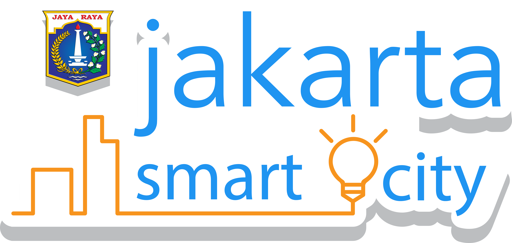

# Pagpapakilala

Ang MapaKalamidad ay pinapatakbo ng [Yayasan Peta Bencana](https://info.petabencana.id/), bilang isang libre at transparent na plataporma para sa agarang tugon at pamamahala ng kalamidad sa mga megacities sa Timog at Timog-silangang Asya.

Ang plataporma ay isinasatupad ang kasabihang "people are the best sensors" kung saan ang pinagtibay na ulat ay kinokolekta direkta mula sa mga gumagamit sa daan upang iwasan ang mga hindi mabisang pamamaraan ng pagkolekta at pag proseso ng datos. Ang framework na ito ay lumilikha ng tumpak at real-time na datos na ginawa para sa mga gumagamit, lalo na sa mga first responders.

Ang MapaKalamidad.ph ay nagtitipon, nag-aayos, at nagpapakita ng datos gamit ang CogniCity Open Source Software na isang plataporma para sa agarang tugon at pamamahala ng kalamidad na ginagamit ang ingay ng social at digital na media sa kritikal na impormasyon para sa mga residente, mga komunidad, at mga ahensya ng gobyerno.

## Petabencana Data API

Petabencana is backed by a data [API](https://en.wikipedia.org/wiki/Application_programming_interface) exposing a number of public and private endpoints. The documentation that follows allows developers to get up and running. The project is fully open source and the code is available in the [PetaBencana GitHub](https://github.com/petabencana/). The architectural diagram is available in different formats:

* [PDF](https://github.com/petabencana/petabencana-docs/tree/d8b3cac5b3bc2a65abd49d874bf9c5798e93eb97/petabencana.pdf)
* [Visio XML](https://github.com/petabencana/petabencana-docs/tree/d8b3cac5b3bc2a65abd49d874bf9c5798e93eb97/petabencana.vdx)
* [OmniGraffle](https://github.com/petabencana/petabencana-docs/tree/d8b3cac5b3bc2a65abd49d874bf9c5798e93eb97/petabencana.graffle.zip)

### Our Sponsors

#### Funding partners

 

#### Sustaining Partners

#### Data Partners

#### Implementing Partners

#### Project Partners

  

